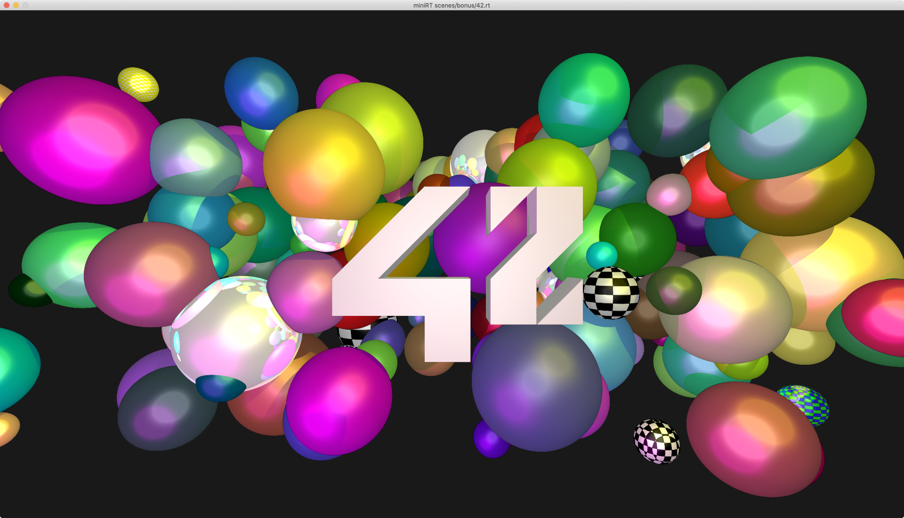
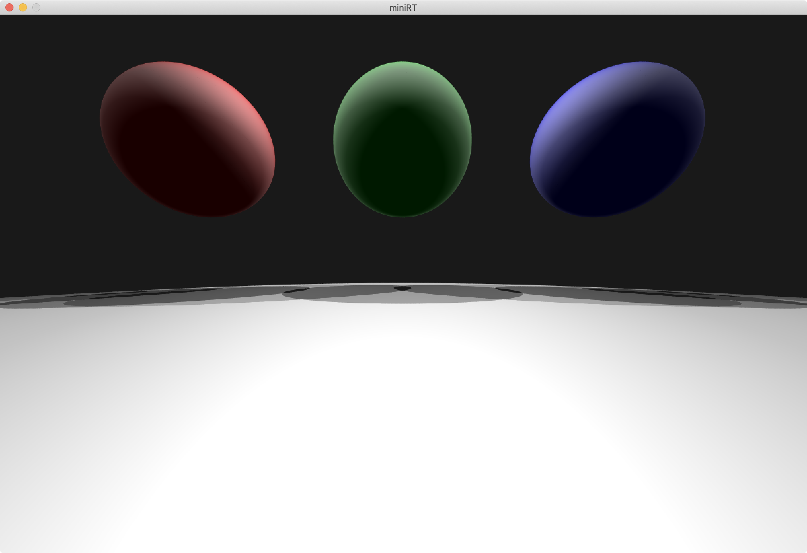
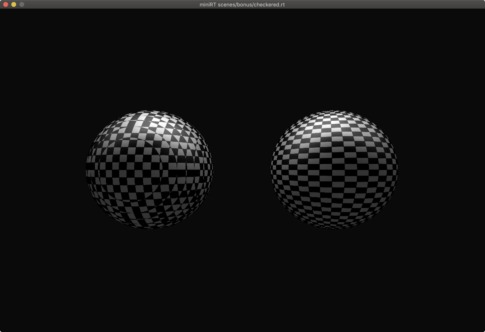
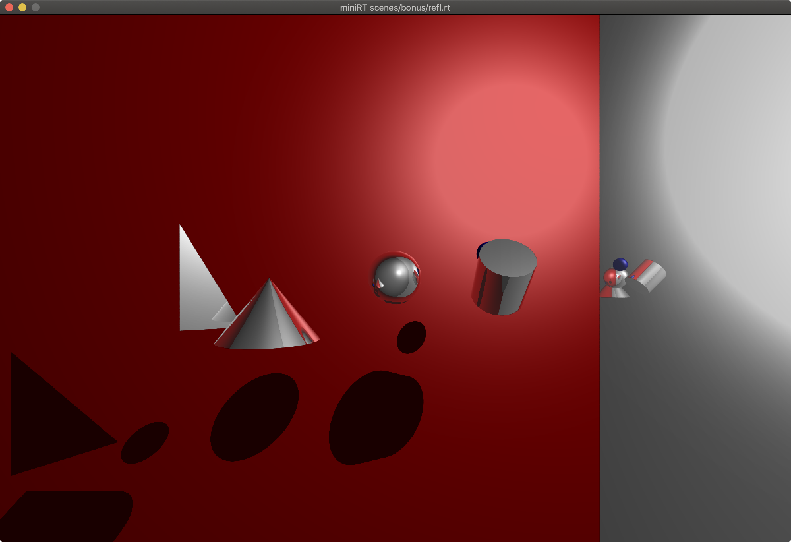
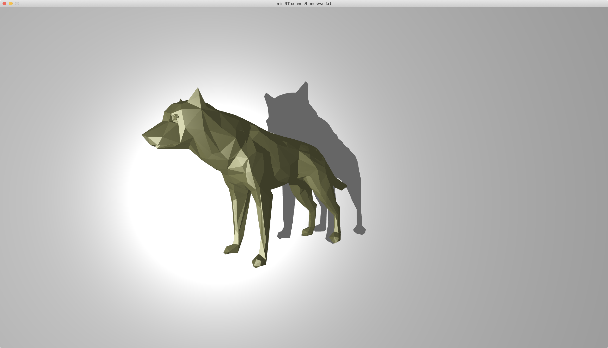
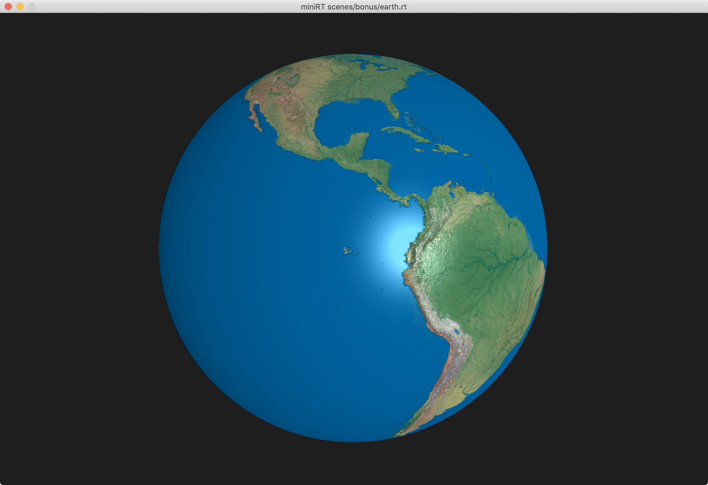
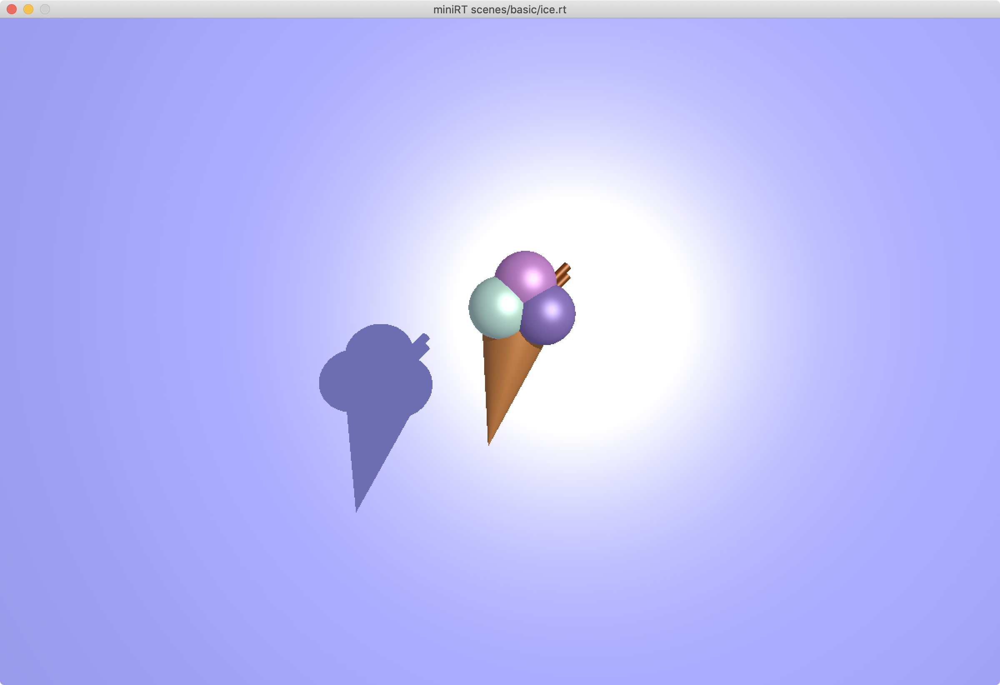
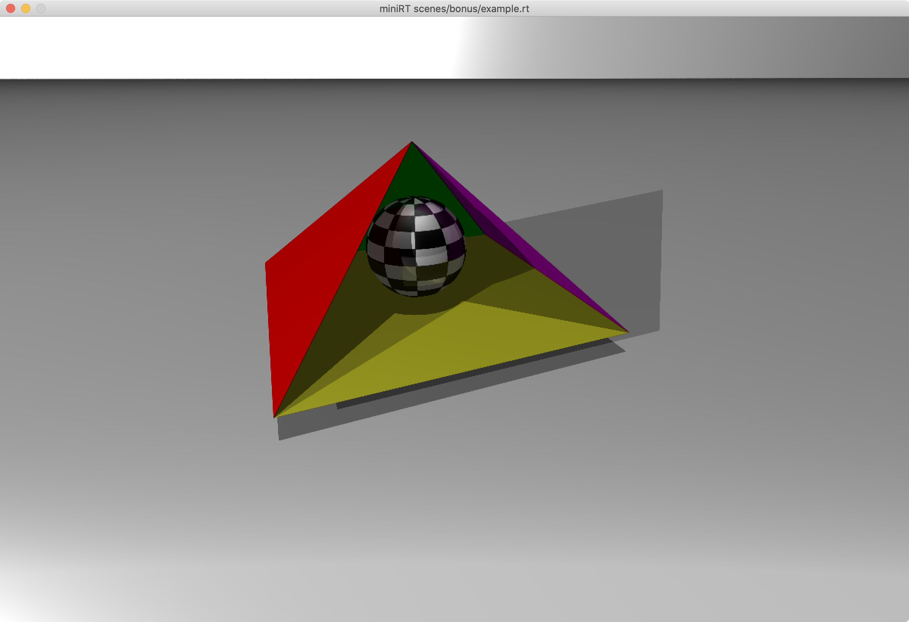
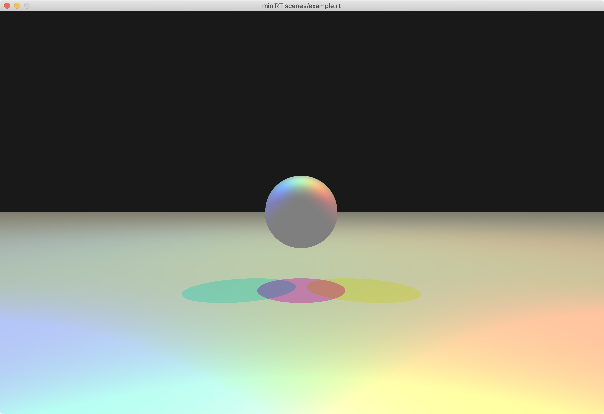

<p align="center">
  
</p>

<p align="center">
  Score: <i>125/100</i><br>
  Finished: <i>11.07.2024</i>
</p>

# miniRT
*This project is an introduction to the beautiful world of Raytracing.*

<p align="center">

</p>

### Compiling
- Use `make` to compile the project.
- For higher resolution use `make hd`.

### Running
- Run the program with `./miniRT [scene.rt]`.
- Example scenes are in the `scenes` directory.

# Scenes
Every scene needs to have a `.rt` extension. A detailed Explanation of the object Configuration can be found here: [Object Syntax](scenes/README.md)
```
# simple example scene
A	0.5			255,255,255
L	-50,40,0	0.6				255,255,255
C	0,0,-10		0,0,1			70.0
sp	0,0,0		5				255,255,255
```

## Supported Objects
- Camera
- Lights: Point, Ambient
- Solids: Sphere, Plane, Triangle, Cylinder, Cone
- Materials (for all Objects)
- Textures:
	 - Checkered (for all Objects)
	 - UV Checkerboard (Spheres)
	 - Image Textures (Spheres)
- Bump Maps (Spheres)

# Features
- Multithreading (number of threads as optional paramter on the camera object)
- Anti-Aliasing (number of samples as optional parameter on the camera object)
- Shadows
- Reflections
- Full Phong Shading

# Examples
### Basic
<p align="center">


</p>
 
### Advanced
#### Checkerboard Texture
Left: Checkered using global coordinates, Right: Checkered using UV coordinates. Colors can be defined in the scene file.
```
TC checkered 255,255,255 0,0,0 1
TUC uvcheckered 0,0,0 255,255,255 40
```
<p align="center">

</p>

#### Reflections
All objects can have a reflection value between 0 and 1. Also there is a maximum recursion depth for reflections that can be set as an optional parameter on the camera object.
<p align="center">

</p>

#### Rendering Complex Objects using Triangles
Using the [mini-rt-mesh-converter](https://github.com/matboivin/minirt_mesh_converter) to convert `.obj` files to `.rt` files, you can render complex objects. Make sure your `.obj` file is triangulated.

<p align="center">

</p>

#### Image Textures & Bump Maps
For spheres you can use image textures and bump maps. The bump map is a greyscale image that will be used to displace the normals of the sphere. The image texture is a regular image that will be mapped onto the sphere.
```
TF earth scenes/assets/earth.png
B bump scenes/assets/earth_bump.png
```
<p align="center">

</p>

#### Anti-Aliasing
Anti-Aliasing can be enabled by setting the number of samples on the camera object. The more samples, the smoother the edges. Drag the slider to see the difference.
<p align="center">
  <div style="position:relative; display:inline-block; line-height:0; left:50%; transform:translateX(-50%); width:80%; max-width:500px; min-width:300px;">
    <div style="position:absolute; top:0; bottom:0; left:0; width:25px; max-width:100%; overflow:hidden; resize:horizontal;">
      
      <div style="position:absolute; right:0; bottom:0; width:13px; height:13px; padding:5px; background:linear-gradient(-45deg, white 50%, transparent 0); background-clip:content-box; cursor:ew-resize; filter:drop-shadow(0 0 2px black); -webkit-filter:drop-shadow(0 0 2px black);"></div>
    </div>
    
  </div>
</p>

#### Multiple Lights
You can have multiple lights in the scene. The color and intensity of the light can be set in the scene file.
<p align="center">

</p>

#### Colored Lights

<p align="center">

</p>